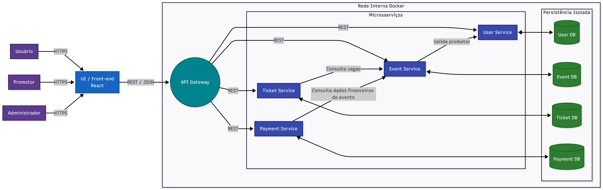
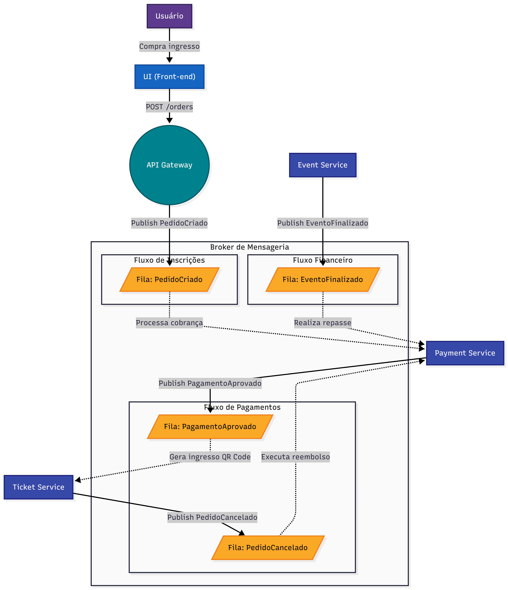

# Ticketeira

Plataforma acadêmica de **gestão de eventos e ingressos** em microsserviços, projetada para suportar alta concorrência na abertura de vendas, garantir unicidade de ingressos e processar pagamentos de forma assíncrona com escrow.

Projeto da disciplina **Engenharia de Software II**.

---

## Sumário

- [Visão geral](#visão-geral)
- [Atores e responsabilidades](#atores-e-responsabilidades)
- [Stack tecnológica](#stack-tecnológica)
- [Status — Sprint 0](#status--sprint-0)
- [Estrutura do repositório](#estrutura-do-repositório)
- [Setup rápido](#setup-rápido)
- [Portas e conflitos comuns](#portas-e-conflitos-comuns)
- [URLs úteis](#urls-úteis)
- [Smoke test ponta-a-ponta](#smoke-test-ponta-a-ponta)
- [Detalhes dos serviços](#detalhes-dos-serviços)
- [Fluxos de domínio (RabbitMQ)](#fluxos-de-domínio-rabbitmq)
- [Autenticação JWT](#autenticação-jwt)
- [Rodando os testes](#rodando-os-testes)
- [Documentação interna](#documentação-interna)
- [Roadmap](#roadmap)
- [Convenções](#convenções)
- [Licença](#licença)

---

## Visão geral

O sistema cobre todo o ciclo de vida de um evento pontual: **cadastro do organizador → verificação como promotor → criação do evento → inscrição (gratuita ou paga com escrow) → emissão de ingresso único com QR → check-in no dia → avaliação pós-evento → reembolso ou repasse**.

A arquitetura é dividida em **4 microsserviços de domínio + API Gateway**, com persistência isolada por serviço (PostgreSQL) e mensageria assíncrona (RabbitMQ) para fluxos pesados (pagamento, reembolso, repasse).



**Decisões arquiteturais principais** (detalhes em [`docs/adr/`](docs/adr)):

- Microsserviços por bounded context, banco-por-serviço — [ADR 0001](docs/adr/0001-arquitetura-microsservicos.md), [ADR 0002](docs/adr/0002-database-per-service.md).
- Auth stateless JWT validada no Gateway, serviços confiam em headers `X-User-*` — [ADR 0003](docs/adr/0003-jwt-stateless-auth.md).
- RabbitMQ topic exchange com DLQ por fila — [ADR 0004](docs/adr/0004-rabbitmq-eventos-assincronos.md).
- Monorepo Maven multi-module — [ADR 0005](docs/adr/0005-monorepo-com-maven-multimodule.md).

---

## Atores e responsabilidades

| Ator | Faz no sistema |
|---|---|
| **Usuário participante** | Busca eventos, se inscreve, paga, recebe ingresso único, faz check-in, avalia. |
| **Promotor verificado** | Cria/edita/cancela eventos, gerencia capacidade, finaliza evento, recebe repasse, valida ingressos. |
| **Administrador** | Aprova perfis de promotor (`verificado = true`), audita operações financeiras. |

---

## Stack tecnológica

| Camada | Tecnologia |
|---|---|
| **Backend** | Spring Boot 3.3.5 · Java 21 (Temurin) · Maven 3.9 multi-module |
| **Gateway** | Spring Cloud Gateway 2023.0.x · filtro JWT customizado |
| **Auth** | Spring Security · BCrypt · `jjwt 0.12.x` (HS256/HS384) |
| **Persistência** | PostgreSQL 16-alpine · Flyway · JPA/Hibernate 6.5 |
| **Mensageria** | RabbitMQ 3.13-management · topic + DLX + DLQs |
| **Docs API** | springdoc-openapi 2.6 (Swagger UI por serviço) |
| **Frontend** | React 18 · Vite 5 · TypeScript 5.6 · axios · react-router-dom v6 |
| **Infra** | Docker Compose v2 · perfis `backend`/`frontend` |
| **CI** | GitHub Actions (workflows separados por path) |
| **Testes** | JUnit 5 · AssertJ · Spring Boot Test · H2 (in-memory para integração) |

---

## Status — Sprint 0

Sprint 0 entrega **toda a fundação técnica**. Sprints seguintes implementam regras de negócio sem retrabalho.

- ✅ Monorepo Maven com parent POM + `shared/common-lib` (DTOs, exceções, `JwtUtil`).
- ✅ Docker Compose com infra (Postgres + RabbitMQ) + 5 backends + frontend, gerenciado por perfis.
- ✅ 4 databases isolados criados via init script + Flyway V1 em cada serviço.
- ✅ Topologia RabbitMQ (2 exchanges, 6 filas, 6 bindings) carregada via `definitions.json`.
- ✅ **API Gateway** com `JwtAuthGlobalFilter` (valida Bearer, injeta `X-User-Id/Email/Verified`, whitelist) e `StripPrefix=1`.
- ✅ **User Service** funcional ponta-a-ponta: `register`, `login` (BCrypt + JWT), `me`, `verify`. Cobertura de testes: 4 cenários de integração com H2.
- ✅ **Event/Ticket/Payment Service** com esqueleto, schemas Flyway completos (incluindo `UNIQUE(usuario_id, evento_id)` em `inscricoes`, CHECK constraints de status e seed de taxa).
- ✅ **Frontend** com login/cadastro/perfil, axios com interceptor JWT, persistência em `localStorage`, smoke test de health.
- ✅ **CI** GitHub Actions: backend (`mvn verify` reactor inteiro) + frontend (`npm run build` + lint), com path filters e cache.
- ✅ **5 ADRs** + **4 specs OpenAPI** + **setup.md** com troubleshooting.

**Smoke test E2E validado:** 9 testes Maven verdes + login real via Gateway → token JWT → `/users/me` → 200 com perfil persistido.

---

## Estrutura do repositório

```
ticketeira/
├── pom.xml                              # Parent POM (BOM Spring Boot, Java 21)
├── docker-compose.yml                   # Stack com perfis backend/frontend
├── .env.example                         # Variáveis de ambiente (copiar para .env)
├── .gitattributes                       # Força LF em arquivos sensíveis em containers
│
├── shared/
│   └── common-lib/                      # DTOs, exceções e JwtUtil compartilhados
│
├── services/
│   ├── api-gateway/                     # Spring Cloud Gateway + JwtAuthGlobalFilter
│   ├── user-service/                    # Auth funcional (register/login/me)
│   ├── event-service/                   # Skeleton (CRUD eventos + avaliações)
│   ├── ticket-service/                  # Skeleton (inscrições + ingressos + check-in)
│   └── payment-service/                 # Skeleton (escrow + reembolso + repasse)
│
├── frontend/                            # React + Vite + TS (login/cadastro/perfil)
│
├── infra/
│   ├── postgres/init/                   # SQL que cria os 4 databases
│   └── rabbitmq/                        # definitions.json + rabbitmq.conf
│
├── docs/
│   ├── adr/                             # 5 Architecture Decision Records
│   ├── api/                             # OpenAPI 3 por serviço
│   ├── diagrams/                        # C4 container + broker AMQP
│   └── setup.md                         # Guia de dev local + troubleshooting
│
└── .github/workflows/                   # CI (backend.yml + frontend.yml)
```

---

## Setup rápido

```powershell
git clone https://gitlab.com/matheushbm192/joinup.git ticketeira
cd ticketeira

# Copiar variáveis (Windows / Linux)
copy .env.example .env
# cp .env.example .env

# Editar .env e trocar JWT_SECRET por algo aleatório >= 32 chars:
#   PowerShell:  -join ((48..122) | Get-Random -Count 48 | % { [char]$_ })
#   Linux/Mac:   openssl rand -base64 48

# Subir tudo (infra + 5 backends + frontend)
docker compose --profile backend --profile frontend up -d --build
```

### Perfis do compose

| Comando | O que sobe |
|---|---|
| `docker compose up -d` | apenas infra (Postgres + RabbitMQ) |
| `docker compose --profile backend up -d --build` | infra + Gateway + 4 microsserviços |
| `docker compose --profile frontend up -d --build` | infra + frontend Vite |
| `docker compose --profile backend --profile frontend up -d --build` | tudo |

### Derrubar

```bash
docker compose --profile backend --profile frontend down            # mantém volumes
docker compose --profile backend --profile frontend down -v         # apaga dados (DB + Rabbit)
```

---

## Portas e conflitos comuns

| Serviço | Porta padrão | Variável `.env` |
|---|---|---|
| Frontend (Vite) | 5173 | `FRONTEND_PORT` |
| API Gateway | 8080 | `GATEWAY_PORT` |
| User Service | 8081 | `USER_SERVICE_PORT` |
| Event Service | 8082 | `EVENT_SERVICE_PORT` |
| Ticket Service | 8083 | `TICKET_SERVICE_PORT` |
| Payment Service | 8084 | `PAYMENT_SERVICE_PORT` |
| Postgres | 5432 | `POSTGRES_PORT` |
| RabbitMQ AMQP | 5672 | `RABBITMQ_PORT` |
| RabbitMQ Management UI | 15672 | `RABBITMQ_MGMT_PORT` |

**Conflitos típicos no Windows:**

- `5432` quase sempre está ocupado por uma instalação local do Postgres → use `POSTGRES_PORT=15432`.
- `8080`/`8081` costumam ser usados por outros apps Java/Node → use `18080`/`18081`.
- Se alterar `GATEWAY_PORT`, **lembre de alterar `VITE_API_URL`** no `.env` para a mesma porta.

Troubleshooting detalhado em [`docs/setup.md`](docs/setup.md).

---

## URLs úteis

Após `docker compose up`:

| Recurso | URL | Credencial |
|---|---|---|
| Frontend | http://localhost:5173 | — |
| **API Gateway** | http://localhost:8080 | — |
| Gateway health | http://localhost:8080/actuator/health | — |
| RabbitMQ Management UI | http://localhost:15672 | `ticketeira` / `ticketeira` |
| Swagger UI — user | http://localhost:8081/swagger-ui.html | — |
| Swagger UI — event | http://localhost:8082/swagger-ui.html | — |
| Swagger UI — ticket | http://localhost:8083/swagger-ui.html | — |
| Swagger UI — payment | http://localhost:8084/swagger-ui.html | — |

> Substitua `8080`, `8081`, etc. pelas portas do seu `.env` se você as deslocou.

---

## Smoke test ponta-a-ponta

```bash
G=http://localhost:8080

# 1. Health
curl $G/actuator/health
# {"status":"UP"}

# 2. Cadastro
curl -X POST $G/api/auth/register -H "Content-Type: application/json" \
  -d '{"nome":"Ana","email":"ana@example.com","senha":"senha123"}'
# 201 {"id":1,"nome":"Ana","email":"ana@example.com","verificado":false,...}

# 3. Login
TOKEN=$(curl -s -X POST $G/api/auth/login -H "Content-Type: application/json" \
  -d '{"email":"ana@example.com","senha":"senha123"}' \
  | python -c "import sys,json;print(json.load(sys.stdin)['token'])")

# 4. Perfil autenticado
curl $G/api/users/me -H "Authorization: Bearer $TOKEN"

# 5. Rota protegida sem token (deve dar 401)
curl -i $G/api/users/me

# 6. Roteamento via Gateway → event-service (stub)
curl $G/api/events -H "Authorization: Bearer $TOKEN"
# 200 []
```

---

## Detalhes dos serviços

| Serviço | Porta | Database | Status | Principais endpoints |
|---|---|---|---|---|
| **api-gateway** | 8080 | — | ✅ funcional | `/actuator/health`, roteamento `/api/**` + JWT filter |
| **user-service** | 8081 | `user_db` | ✅ funcional | `POST /auth/register`, `POST /auth/login`, `GET /users/me`, `PUT /users/{id}/verify` |
| **event-service** | 8082 | `event_db` | 🟡 skeleton | `GET /events`, `GET /events/{id}`, `POST /events` (501) |
| **ticket-service** | 8083 | `ticket_db` | 🟡 skeleton | `POST /tickets/inscricoes` (501), `GET /tickets/me` |
| **payment-service** | 8084 | `payment_db` | 🟡 skeleton | `GET /payments/me` |

Schemas iniciais (Flyway V1) em `services/*/src/main/resources/db/migration/V1__init.sql`. Contratos detalhados em [`docs/api/`](docs/api).

---

## Fluxos de domínio (RabbitMQ)



**3 eventos AMQP** circulam via topic exchange `ticketeira.events`:

| Evento (routing key) | Publicado por | Consumido por | Trigger |
|---|---|---|---|
| `pedido.criado` | ticket-service | payment-service | Inscrição em evento pago — inicia cobrança |
| `pagamento.aprovado` | payment-service | ticket-service | Cobrança confirmada — emite ingresso (QR) |
| `evento.finalizado` | event-service | payment-service | Evento realizado — dispara repasse ao promotor |

**Dead Letter Queues:** cada fila tem `*.dlq` ligada ao exchange `ticketeira.dlx`. Mensagens que falham N retries vão para a DLQ — debug + reprocessamento manual via Management UI.

**Idempotência:** consumers (Sprint 1) precisam manter tabela `processed_events(event_id, processed_at)` para descartar duplicatas, já que RabbitMQ garante at-least-once.

Detalhes em [ADR 0004](docs/adr/0004-rabbitmq-eventos-assincronos.md).

---

## Autenticação JWT

```
Browser              Gateway (8080)       user-service (8081)         Outros services
   |                     |                      |                          |
   |--- POST /api/auth/login (email,senha) ---->|                          |
   |                     |--- POST /auth/login -->                          |
   |                     |                      |-- BCrypt match           |
   |                     |                      |-- JwtUtil.generateToken  |
   |                     |<----- JWT (HS256) ---|                          |
   |<-- 200 {token, expiresInMs} ---------------|                          |
   |                                                                       |
   |--- GET /api/users/me  Authorization: Bearer <JWT> ----->|             |
   |                     |-- JwtAuthGlobalFilter:                          |
   |                     |   validateToken() OK                            |
   |                     |   injeta X-User-Id, X-User-Email, X-User-Verified
   |                     |-- StripPrefix=1: /api/users/me -> /users/me ----|
   |                     |                      |-- lê X-User-Id           |
   |                     |                      |-- repository.findById    |
   |                     |<----- 200 {usuario} -|                          |
   |<-- 200 {usuario} ---|                                                  |
```

**Whitelist** (não exige JWT): `/api/auth/register`, `/api/auth/login`, `/actuator/health`, `/v3/api-docs`, `/swagger-ui`.

**Para qualquer outro path:** ausência de `Authorization: Bearer ...` ou JWT inválido → **401** com `ErrorResponse` em JSON. Tokens expirados, adulterados ou com secret diferente são rejeitados pelo `JwtUtil.validateToken()` em `shared/common-lib`.

Justificativa do design em [ADR 0003](docs/adr/0003-jwt-stateless-auth.md).

---

## Rodando os testes

### Backend (Maven, qualquer módulo)

Sem JDK 21 local — usar Maven dockerizado:

```bash
# Reactor inteiro (recomendado)
docker run --rm -v "${PWD}:/work" -v "ticketeira-m2:/root/.m2" -w /work \
  maven:3.9-eclipse-temurin-21 mvn -B -ntp test

# Um módulo só
docker run --rm -v "${PWD}:/work" -v "ticketeira-m2:/root/.m2" -w /work \
  maven:3.9-eclipse-temurin-21 mvn -B -ntp -pl services/user-service -am test
```

Com JDK 21 + Maven instalados localmente:

```bash
mvn verify                          # build + testes do reactor inteiro
mvn -pl services/user-service -am test
```

**Cobertura atual (Sprint 0):**
- `common-lib`: 4 testes (`JwtUtilTest`) — geração, validação, rejeição de adulteração, secret mínimo.
- `user-service`: 4 testes de integração (H2) — register, login, duplicate email, senha errada.
- Demais serviços: 1 smoke test cada (`contextLoads`).

### Frontend

```bash
cd frontend
npm install
npm run build      # tsc + vite build
npm run lint
npm run dev        # http://localhost:5173
```

Ou via container (sem Node local):

```bash
docker compose --profile frontend up -d --build
docker exec ticketeira-frontend npm run build
```

---

## Documentação interna

| Documento | Localização |
|---|---|
| Guia de setup detalhado + troubleshooting | [`docs/setup.md`](docs/setup.md) |
| ADR 0001 — Arquitetura microsserviços | [`docs/adr/0001-arquitetura-microsservicos.md`](docs/adr/0001-arquitetura-microsservicos.md) |
| ADR 0002 — Database-per-service | [`docs/adr/0002-database-per-service.md`](docs/adr/0002-database-per-service.md) |
| ADR 0003 — JWT stateless | [`docs/adr/0003-jwt-stateless-auth.md`](docs/adr/0003-jwt-stateless-auth.md) |
| ADR 0004 — RabbitMQ eventos assíncronos | [`docs/adr/0004-rabbitmq-eventos-assincronos.md`](docs/adr/0004-rabbitmq-eventos-assincronos.md) |
| ADR 0005 — Monorepo Maven multi-module | [`docs/adr/0005-monorepo-com-maven-multimodule.md`](docs/adr/0005-monorepo-com-maven-multimodule.md) |
| OpenAPI 3 — user-service | [`docs/api/user-service.yaml`](docs/api/user-service.yaml) |
| OpenAPI 3 — event-service | [`docs/api/event-service.yaml`](docs/api/event-service.yaml) |
| OpenAPI 3 — ticket-service | [`docs/api/ticket-service.yaml`](docs/api/ticket-service.yaml) |
| OpenAPI 3 — payment-service | [`docs/api/payment-service.yaml`](docs/api/payment-service.yaml) |
| Diagrama C4 de containers | [`docs/diagrams/architecture.png`](docs/diagrams/architecture.png) |
| Diagrama topologia broker | [`docs/diagrams/broker.png`](docs/diagrams/broker.png) |

---

## Roadmap

| Sprint | Escopo | Status |
|---|---|---|
| **Sprint 0** | Monorepo, infra, gateway, auth funcional, skeletons, frontend, CI, docs | ✅ |
| Sprint 1 | RF02 (criar eventos), RF03 (inscrição com lock otimista), RF04 (ingresso QR), RF09 (histórico) | ⬜ |
| Sprint 2 | RF05 (pagamento simulado + escrow), RF06 (reembolso), saga de inscrição paga | ⬜ |
| Sprint 3 | RF07 (cancelamento com política), RF08 (avaliações + reputação), RF10 (check-in com QR scan) | ⬜ |
| Sprint 4 | RNF09 (testes de carga JMeter/Gatling), observabilidade (Prometheus/Grafana), refinos UX | ⬜ |

Requisitos completos (RF01–RF10, RNF01–RNF10) no documento da disciplina.

---

## Convenções

- **Branch principal:** `main`. Branches de feature: `feat/<tema>`, `fix/<tema>`.
- **Commits:** [Conventional Commits](https://www.conventionalcommits.org/) curtos — `feat:`, `fix:`, `docs:`, `chore:`, `refactor:`, `test:`, `ci:`. Sem co-autoria adicional na trailer.
- **Idioma:** identificadores em inglês (classes, métodos, variáveis), comentários e docs em português brasileiro.
- **Encoding:** UTF-8, line-endings LF (enforçado por `.editorconfig` + `.gitattributes`).
- **Configuração:** sem segredos em código. Tudo via `.env` (gitignored). `.env.example` mantém placeholders.
- **Estrutura de tabelas:** snake_case nas colunas Postgres; camelCase em DTOs Java e TypeScript.

---

## Licença

Projeto acadêmico — uso restrito ao escopo da disciplina de Engenharia de Software II.
